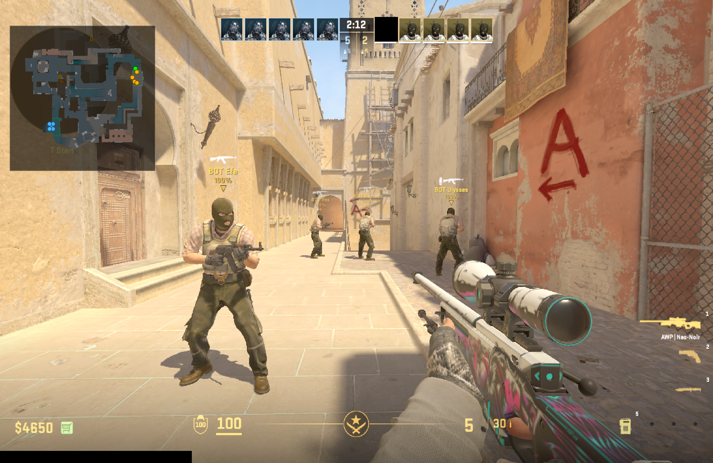
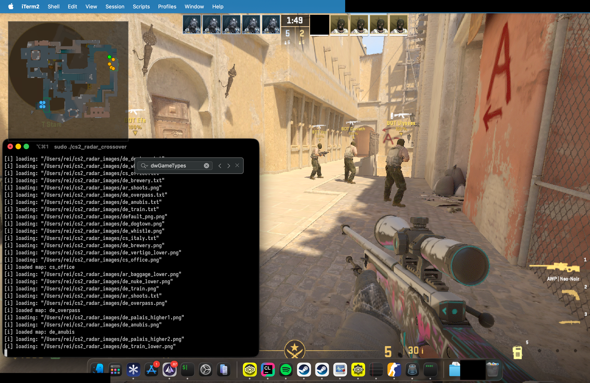
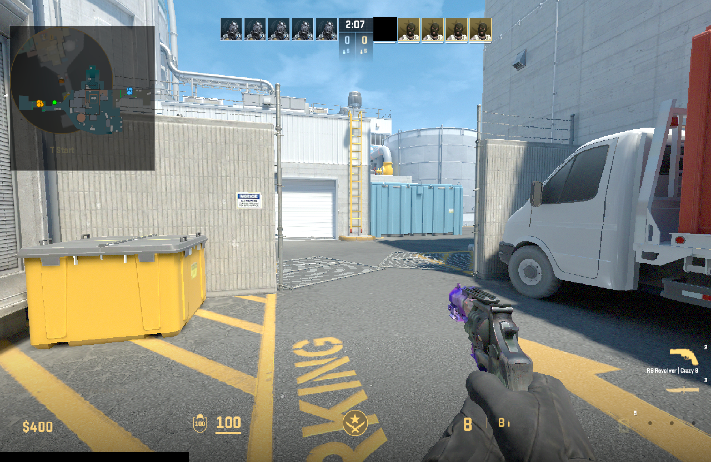

# External Radar for CS2 on macOS (CrossOver)

External radar for CS2 running under CrossOver on macOS.
Why? I was lowkey bored lmao...

## Usage

1. Clone the repo
2. Get cs2 radar images (I used https://github.com/2mlml/cs2-radar-images), put them as <code>~/cs2_radar_images</code> or change the path in the sources accordingly
3. Build it using CLion or some other type of thing (glfw3 is required), ChatGPT, Google is your friends
4. Disable SIP, launch it using <code>sudo ./cs2_radar_crossover</code>, it'll be located in cmake-build-debug directory
5. Enjoy

## Future?

I don't really care about this, but I might make some basic ESP functionality, but it'll be as another repo and shi.
I mean, it's basically made like other external mods on Windows, so you might just paste some shit here and enjoy it.
Also pull requests are open??

## Preview

  
  
  

